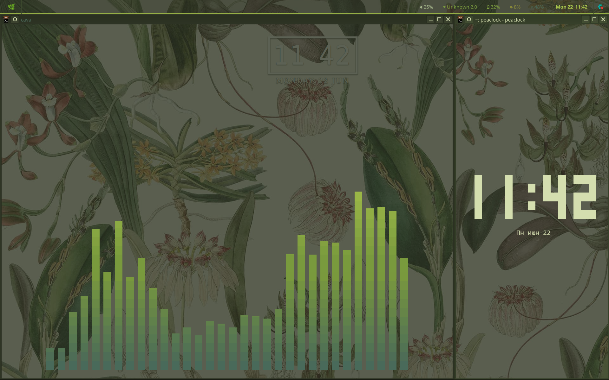
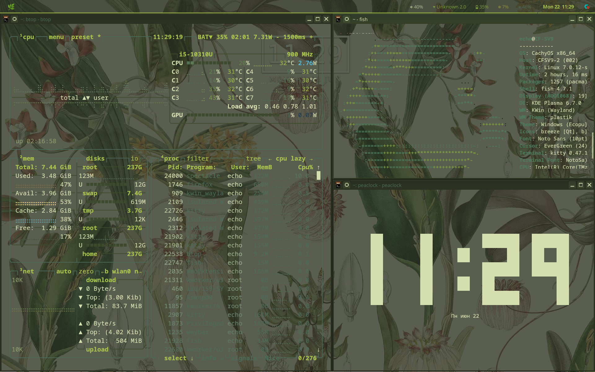
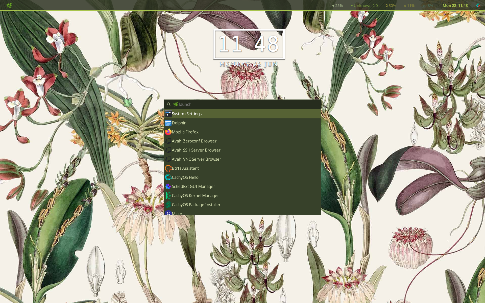
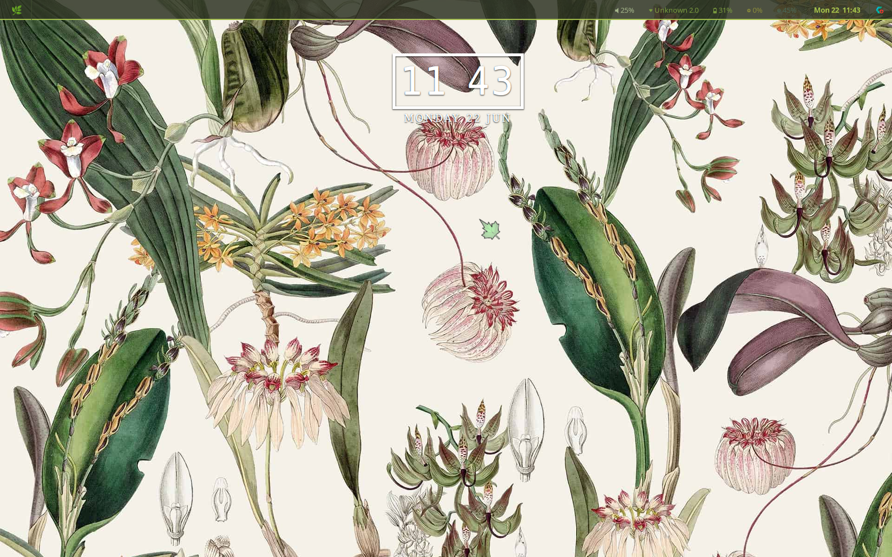

# 🌿 ecopunk rice

> *a machine where digital systems and living ecosystems don't compete — they start collaborating*

my personal desktop rice for CachyOS + KDE Plasma on Wayland.

---

## screenshots


*deep olive ground, the wallpaper bleeding through the chrome at 85%*

---


*system vitals reading like a terrarium, not a dashboard. cava is the machine's heartbeat*

---


*wofi mid-search, waybar acid moss border, the forest behind the chrome*

---


*overcast. milky green. the moss gets more saturated when the sun disappears*

---

## the idea

this didn't start at a desk.

it started in a forest in **osaka — meiji no mori** — walking through that dense, quiet kind of green where everything feels like it's been slowly optimizing itself for centuries without asking anyone's permission.

and somewhere between the light filtering through cedar trees and the sound of everything just *existing*, it hit me how aggressively our digital lives have drifted away from anything like that. everything online feels increasingly cleaned up, stripped, optimized, and slowly enshittified into something that serves companies more than it serves people or reality.

so the idea became simple: **what if the interface didn't reject that feeling of nature — what if it absorbed it?**

not as decoration. not as wallpaper. but as structure.

---

## the tension

Y2K UI was obsessed with showing you the machine — grids, raw system data, the chrome on full display.

ecopunk borrows that honesty but asks: **what if the machine had been left outside long enough?**

the brutalist backbone stays. sharp alignment, monospace logic, system visibility. it still tells you exactly what it's doing. but the surface is pulled from living systems — moss, bark, wet stone, deep canopy shadow. the result sits somewhere between a **terminal and a terrarium**. a system left running in a forest long enough to start adapting.

---

## the design language

- colors sampled from moss, bark, wet stone, and deep canopy shadow
- greens that feel slightly too alive, like they're still growing
- muted greys that behave like concrete left under rain and soil
- occasional warm highlights that feel accidental, like sunlight slipping through leaves at the wrong angle
- waybar at 85% opacity — the chrome doesn't hide what's behind it. the forest should show through

---

## stack

|          |                               |
| -------- | ----------------------------- |
| os       | CachyOS                       |
| desktop  | KDE Plasma (Wayland)          |
| bar      | Waybar                        |
| launcher | Wofi                          |
| terminal | Kitty                         |
| shell    | Fish + Starship               |
| font     | Iosevka                       |
| icons    | Papirus-Light (green folders) |

---

## the tools

| tool     | role                                               |
| -------- | -------------------------------------------------- |
| btop     | system vitals — reads like an organism, not a grid |
| cava     | audio pulse — the machine's heartbeat made visible |
| peaclock | time — brutalist, because it should feel like it   |
| neovim   | editor — same palette, same logic, same forest     |

each one themed to the same 14 colors. nothing that opens in this environment should look like it came from somewhere else.

---

## palette

### dark — forest brutalism

| role       | color          | hex       |
| ---------- | -------------- | --------- |
| background | deep olive     |  `#2E3424` |
| surface    | military olive |  `#3D4A2E` |
| accent     | acid moss      |  `#A8C44C` |
| accent 2   | forest green   |  `#7A9A3E` |
| text       | sage cream     |  `#D4DEAF` |
| muted      | slate fern     |  `#4A6A5A` |
| error      | rust clay      |  `#8B4A35` |

### light — when the forest is overcast

the light theme isn't day mode. it's the same forest in flat light —
no harsh sun, just that quiet milky-green you get when cloud cover
diffuses everything and the cedar needles go almost yellow.
parchment instead of deep olive. the accent greens stay — moss doesn't
disappear in the grey, it gets more saturated.

| role       | color      | hex       |
| ---------- | ---------- | --------- |
| background | parchment  |  `#F0EAD6` |
| surface    | leaf wash  |  `#E8F0D8` |
| accent     | moss green |  `#6B7A3E` |
| accent 2   | acid pop   |  `#A8C44C` |
| text       | dark bark  |  `#2C3420` |
| muted      | lichen     |  `#8A9A6B` |

---

## files

---

## install

```bash
# deps
sudo pacman -S waybar wofi kitty fish starship ttf-iosevka papirus-icon-theme btop cava neovim
yay -S papirus-folders peaclock-bin

# clone
git clone https://github.com/proto6699/ecopunk-rice
cd ecopunk-rice

# core
mkdir -p ~/.config/{waybar,wofi,kitty,fish,btop/themes,cava,peaclock,nvim/colors}
cp waybar/config ~/.config/waybar/config
cp waybar/style.css ~/.config/waybar/style.css
cp wofi/config ~/.config/wofi/config
cp wofi/style.css ~/.config/wofi/style.css
cp kitty/kitty.conf ~/.config/kitty/kitty.conf
cp starship/starship.toml ~/.config/starship.toml
cp fish/config.fish ~/.config/fish/config.fish
cp btop/themes/ecopunk.theme ~/.config/btop/themes/
cp btop/btop.conf ~/.config/btop/btop.conf
cp cava/config ~/.config/cava/config
cp peaclock/config ~/.config/peaclock/config
cp nvim/colors/ecopunk.lua ~/.config/nvim/colors/ecopunk.lua

# icons
papirus-folders -C green --theme Papirus-Light
```

---

## notes

- running on a Panasonic CF-SV9 (japanese model) — enterprise hardware that has no right to look this good running Wayland
- waybar and wofi are 85% opacity so the wallpaper bleeds through the chrome. intentional. the forest should show through
- both color schemes ship — swap in System Settings whenever
- starship prompt puts 🌿 on the left and git status in bark brown

---

*built by a gremlin, themed after a mossy concrete slab 🌿*
